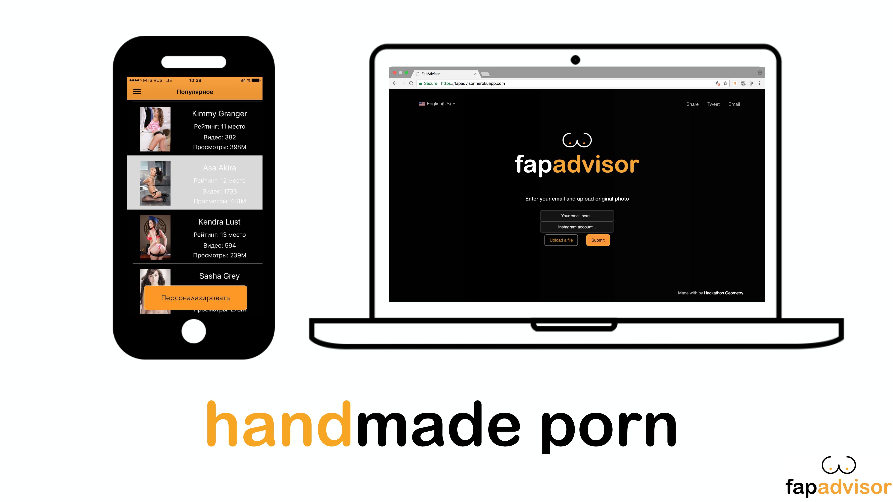
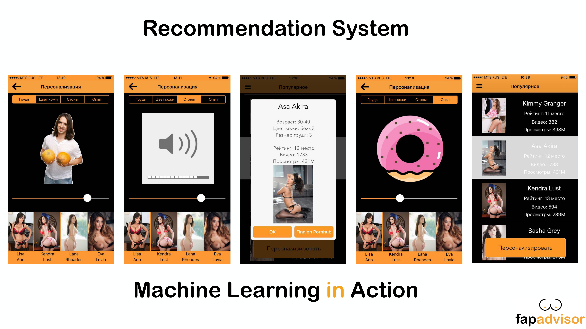
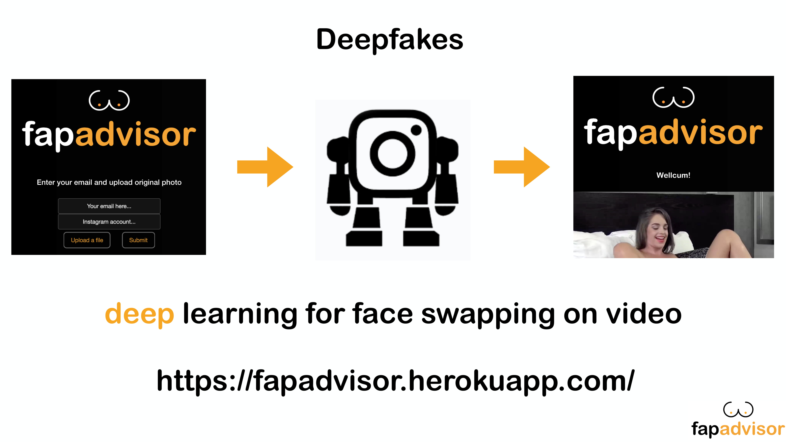
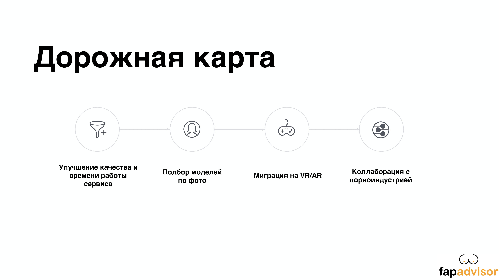
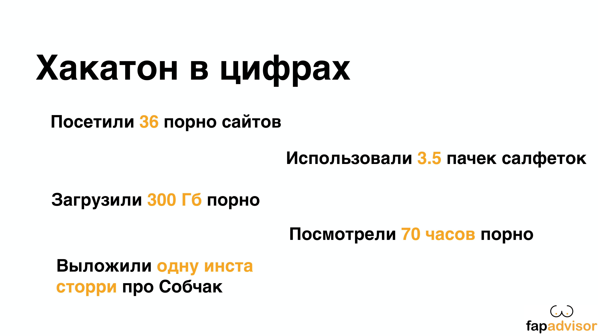
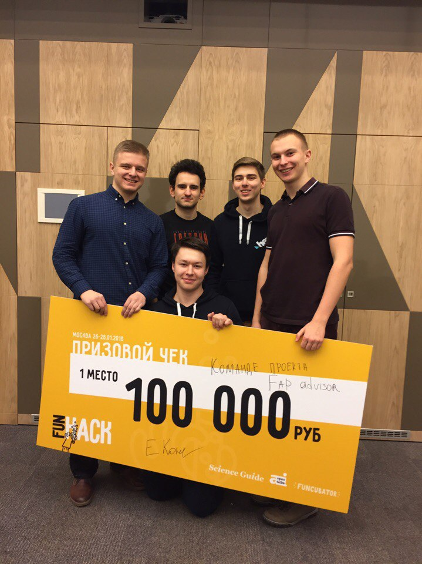

# FunHack
Январь, 2018
## Предыстория
Мы - команда физтехов и потому не понаслышке знаем каково это, жить в обществе почти без девушек!
Представляем вам наш проект - **FapAdvisor**.

В рамках хакатона мы реализовали две сущности: ios-приложение и веб-сервис.

## IOS Приложение
В нашем приложении мы переосмыслили систему рекомендаций порноактрисс, сделав её намного удобнее и практичней в использовании.

Сначала вы попадаете на страничку, где в порядке популярности выведены все порноактриссы.
На каждую можно нажать, чтобы увидеть ее подробные характеристики, а также перейти по ссылке на всем известный [ресурс](https://pornhub.com).

Вы видите систему ползунков, позволяющую моментально получить ссылку на видео с порноактриссой вашей мечты!

Перемещая ползунки, подберите **размер груди**, **цвет кожи**, **громкость стонов**, а также наше любимое, **опытность** девушки.

Выбирайте из обновившегося списка внизу экрана вашу цель и наслаждайтесь! 

## Веб сервис
Мы предлагаем вам наконец реализовать мечту детства!

### Что делать вам
Укажите e-mail, на который хотите получить результат, введите instagram аккаунт цели,
а так же загрузите фото её лица, чтобы мы точно не ошиблись. 
### Что сделаем мы
Мы проанализируем все фотографии девушки, которой принадлежит данный аккаунт, и научимся заменять лицо одной из порноактрисс
на лицо цели.

Подождите немного, пока нейросеть сделает всю работу.

Теперь дело в ваших руках :) Просто смотрите видео, которое придет вам на почту!

## Немного про дальнейшие планы

## Наша *статистика* за хакатон

## И наша награда

[Видео](https://vk.com/away.php?to=https%3A%2F%2Fwww.facebook.com%2FSci.Guide%2Fvideos%2F789450127923308%2F&post=207407465_111&cc_key=) с выступления (смотрим с 57:06)

## Участники

Артём Куприянов (@ArtemKupriyanov)  
Ярослав Спирин (@mountain-viewer)  
Стас Округ (@Konagmo)  
Илья Захаркин (@izakharkin)  
Роман Ушаков (@canorbal)

